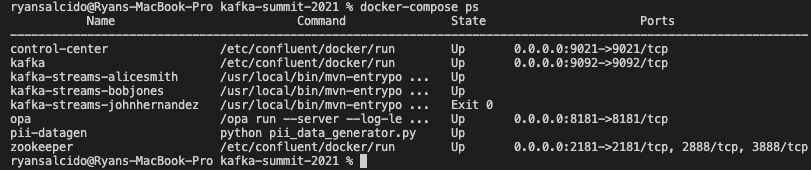
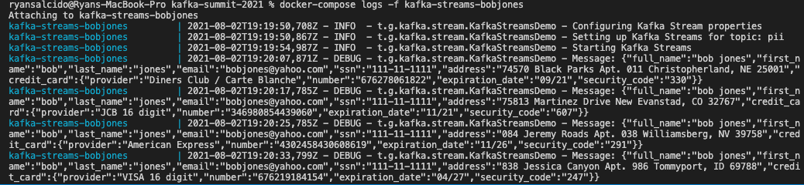
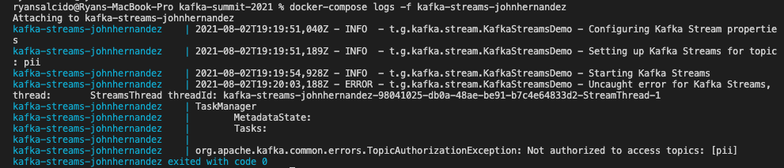

# Kafka Summit 2021: Securing the Message Bus with Kafka Streams


## Overview
Organizations have a need to protect Personally Identifiable Information (PII). As Event Streaming Architecture (ESA) becomes ubiquitous in the enterprise, the prevalence of PII within data streams will only increase. Data architects must be cognizant of how their data pipelines can allow for potential leaks. In highly distributed systems, zero-trust networking has become an industry best practice. We can do the same with Kafka by introducing message-level security.

A DevSecOps Engineer with some Kafka experience can leverage Kafka Streams to protect PII by enforcing role-based access control using Open Policy Agent. Rather than implementing a REST API to handle message-level security, Kafka Streams can filter, or even transform outgoing messages in order to redact PII data while leveraging the native capabilities of Kafka.

In our proposed presentation, we will provide a live demonstration that consists of two consumers subscribing to the same Kafka topic, but receiving different messages based on the rules specified in Open Policy Agent. At the conclusion of the presentation, we will provide attendees with a GitHub repository, so that they can enjoy a sandbox environment for hands-on experimentation with message-level security.


## Objective
The goal is to demonstrate how we can utilize [Open Policy Agent](https://www.openpolicyagent.org/) to provide fine-grained access-control for Kafka topics and the [Kafka Streams API](https://www.confluent.io/product/kafka-streams-api/) to filter outgoing PII messages based on the end user. The demo will show how three different Kafka users (`bobjones`, `alicesmith`, `johnhernandez`) will authenticate to the Kafka broker and receive different results while consuming from the same topic (`pii`).

## Technical Stack
- Confluent v5.5.2 (ZooKeeper, Broker, Control Center)
- Open Policy Agent
- Python 3.8.11
- Java 11
- Maven 3.8.11


## Running via `Docker-Compose`
The technical stack can be bootstrapped using the `docker-compose.yaml` file which starts up the following Docker containers:
- Confluent (ZooKeeper, Broker, Control Center)
- Open Policy Agent
- PII fake data generator using Python
- Kafka Streams for each of the three Kafka SASL users: `bobjones`, `alicesmith`, `johnhernandez`

To get started, run the following command:
```sh
# Prepend 'sudo' if required in your environment
docker-compose up -d
```

Please note that it is expected for the `kafka-streams-johnhernandez` to show an `exit 0`. This is because in the [demo.rego](./policies/demo.rego), `johnhernandez` was not given access to any of the topics. Read the section labeled [Result for kafka-streams-johnhernandez](#result-for-kafka-streams-johnhernandez) for more information.

Example output when running `docker-compose ps`:



### Examining the Logs
To examine the messages received for each of the three Kafka users, run the following command (Be sure to replace the `container_name` placeholder):
```sh
docker logs -f [container_name]
```


#### Result for kafka-streams-bobjones

As expected, when connecting as `bobjones`, we will only be able to view the messages pertaining to him. The same will go for the other users.


#### Result for kafka-streams-johnhernandez

As mentioned before, since we did not grant `johnhernandez` access to any of the topics via OPA, we will receive a `TopicAuthorizationException` when attempting to consume messages.


## Kafka and Open Policy Agent (OPA)
In order for Kafka to integrate with Open Policy Agent, we created a [derivative Docker image](./kafka-opa/Dockerfile) based on the `confluentinc/cp-server:5.5.2` image. We utilized [this](https://github.com/open-policy-agent/contrib/tree/main/kafka_authorizer) GitHub repository which provides the custom authorization code that connects Kafka and OPA. From here, we can provide the following properties to the Kafka broker during startup:
```
# The Java jar path to the OPA class that handles authorization
KAFKA_AUTHORIZER_CLASS_NAME: tech.goraft.kafka.opa.OpaAuthorizer
# The OPA endpoint for handling authorization
KAFKA_OPA_AUTHORIZER_URL: "http://opa:8181/v1/data/kafka/authz/allow"
KAFKA_OPA_AUTHORIZER_ALLOW_ON_ERROR: "false"
KAFKA_OPA_AUTHORIZER_CACHE_INITIAL_CAPACITY: 100
KAFKA_OPA_AUTHORIZER_CACHE_MAXIMUM_SIZE: 100
KAFKA_OPA_AUTHORIZER_CACHE_EXPIRE_AFTER_MS: 600000
```


### OPA's Rego Query Language
The [Rego query language](https://www.openpolicyagent.org/docs/latest/policy-language/) provides a declaritive way to define policies. For this demo, a single [Rego file](./policies/demo.rego) was created to handle the access-control for the various Kafka users. After a user authenticates to the Kafka broker, the defined OPA policies are checked to see if the user has access to the requested topic.


## How to Build/Run the Individual Applications
If you want to go beyond just running the demo via `Docker-Compose`, the following sections will describe how to build and push the applications individually. Please verify the software defined in the [Technical Stack](#technical-stack) section is properly installed on your machine.

__Note__: If you want to test your new image with the original demo, be sure to replace the appropriate image in the [docker-compose.yaml](./docker-compose.yaml).


### Kafka-OPA
1. Change directory to `kafka-opa`:
    ```sh
    cd kafka-opa
    ```
2. Build the Java application using Maven
    ```sh
    mvn clean install
    ```
3. Build the Docker image
    ```sh
    docker build . -t [registry_name]/kafka-opa
    ```
4. Push the Docker image
    ```sh
    docker push [registry_name]/kafka-opa
    ```


### PII-Datagen
1. Change directory to `pii-datagen`:
    ```sh
    cd pii-datagen
    ```
2. Build the Docker image
    ```sh
    docker build . -t [registry_name]/pii-datagen
    ```
3. Push the Docker image
    ```sh
    docker push [registry_name]/pii-datagen
    ```

### Kafka-Streams-Message-Security
1. Change directory to `kafka-streams-message-security`:
    ```sh
    cd kafka-streams-message-security
    ```
2. Build the Docker image
    ```sh
    docker build . -t [registry_name]/kafka-streams-message-security
    ```
3. Push the Docker image
    ```sh
    docker push [registry_name]/kafka-streams-message-security
    ```
